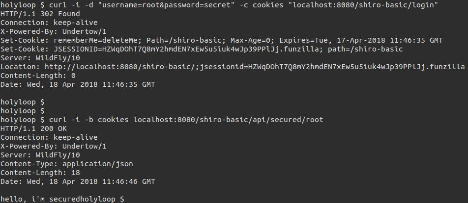

# Java EE 7 集成Apache Shiro

Apache [Shiro](https://shiro.apache.org/) 是一个强大并且易用的Java安全框架，它的主要功能有**认证**（authentication），**鉴权**（authorization），加密和会话管理。在Shiro的易用的API帮助下，我们可以快速便捷地保护任何应用 - 从最小的移动端应用到大型的web企业级应用。

我们在用Java EE构建企业级web应用时，安全是必不可少的。 安全是一个宽泛的概念，在我们的web应用中来说主要有以下几方面：

- 认证（authentication）：确定“你”是不是“你”，与之相关动作的是登录；
- 鉴权（authorization）：确定“你”能不能进行某些操作；
- 加密：一般来说是用户登录口令的加密存储；

 Shiro提供的一系列功能正满足Java EE应用的安全需求，这里我就来介绍一下如何用Shiro来“保护”我们的Java EE web应用。我这里会用到Wildfly 10作为Java EE web应用的应用服务器，maven作为项目的构建工具。下面我们就来看一下具体步骤（源码可以在我的[github](https://github.com/holyloop/javaee-example/tree/master/javaee-shiro-basic)找到）：

## 添加依赖

```xml
<dependency>
  <groupId>javax.enterprise</groupId>
  <artifactId>cdi-api</artifactId>
  <version>1.2</version>
  <scope>provided</scope>
</dependency>
<dependency>
  <groupId>org.jboss.resteasy</groupId>
  <artifactId>jaxrs-api</artifactId>
  <version>3.0.10.Final</version>
</dependency>
<dependency>
  <groupId>org.apache.shiro</groupId>
  <artifactId>shiro-core</artifactId>
  <version>1.3.2</version>
</dependency>
<dependency>
  <groupId>org.apache.shiro</groupId>
  <artifactId>shiro-web</artifactId>
  <version>1.3.2</version>
</dependency>
```

这里我引入了 `cdi-api` ，因为后面我们会用到**拦截器**（Interceptor）来实现Shiro的 `RequiresRoles` 等注解的解析；我们会以REST接口的形式来演示如何保护应用的对外接口，所以这里我引入了 `jaxrs-api`  ；接下来的是Shiro的相关依赖。

## 一个简单的Web应用

我们用 `jaxrs-api` 来实现一个简单的web应用，首先来配置jaxrs：

`src/main/java/com/github/holyloop/rest/config/JaxRsActivator.java`:

```java
@ApplicationPath("/api")
public class JaxRsActivator extends Application {
    /* class body intentionally left blank */
}
```

这样我们的web应用的REST接口路径就是 `$context-root/api/*` 了。

添加几个简单的REST接口，首先添加一个任何人都可以访问的接口：

`src/main/java/com/github/holyloop/rest/controller/AnonController.java`:

```java
@Path("/anon")
public class AnonController {
    @GET
    @Path("/greet")
    @Produces(MediaType.APPLICATION_JSON)
    public Response anyoneCanAccess() {
        return Response.status(Status.OK).entity("hello").build();
    }
}
```

再添加一个受保护的接口（当然，在没配置Shiro之前，它并不是受保护的）：

`src/main/java/com/github/holyloop/rest/controller/SecuredController.java`:

```java
@Path("/secured")
public class SecuredController {
    @GET
    @Path("/root")
    @Produces(MediaType.APPLICATION_JSON)
    public Response roleRootNeeded() {
        return Response.status(Status.OK).entity("hello, i'm secured").build();
    }
}
```

## 配置Shiro

这里方便起见，用户和角色的定义都放在配置文件里面，下一篇文章我会讲解如何配置基于数据库的用户／角色／权限管理。

`src/main/webapp/WEB-INF/shiro.ini`:

```ini
# =============================================================================
# Apache Shiro INI 配置
# =============================================================================

[main]
# authc 是 org.apache.shiro.web.filter.authc.FormAuthenticationFilter 的缩写
authc.loginUrl = /login

# -----------------------------------------------------------------------------
# 用户和他们的角色（可选的）
# username = password, role1, role2, ..., roleN
# -----------------------------------------------------------------------------
[users]
root = secret, admin
guest = guest, guest

# -----------------------------------------------------------------------------
# 角色和其被授予的权限
# roleName = perm1, perm2, ..., permN
# -----------------------------------------------------------------------------
[roles]
admin = *

# -----------------------------------------------------------------------------
# 资源和filter chains
# _URL_Ant_Path_Expression_ = _Path_Specific_Filter_Chain_
# -----------------------------------------------------------------------------
[urls]
/index.html = anon
/api/anon/** = anon
/login = authc
/api/secured/** = authc
```

首先 `[main]` 配置块里面配置了 `authc` 过滤器的 `loginUrl` 值为 `/login` ，`authc` 是Shiro为我们提供的几个默认过滤器之一，其他过滤器的定义可参考[这里](https://shiro.apache.org/static/1.3.2/apidocs/org/apache/shiro/web/filter/mgt/DefaultFilter.html)；然后我们分别在 `[users]` 和 `[roles]` 块里面配置了用户和角色；`[urls]` 中配置了资源路径和对应的过滤器。

需要注意的是URL是相对于应用根路径（context-root）的路径，假如我们的应用一开始为 `www.somehost.com/myapp ` ，后来因为一些原因更改为 `www.anotherhost.com` 了，这里的url配置依然有效；还有比较重要的一点是URL定义的顺序很重要，一个准则是“**谁先匹配谁胜出**”(FIRST MATCH WINS)，例如我们定义了:

```ini
/account/** = ssl, authc
/account/signup = anon
```

那么就会出现问题：假如一个请求想访问 `/account/signup/index.html` （应允许任意用户访问），它将永远不会被处理，因为 `/account/**` 先匹配该路径，它“短路”了剩余的匹配定义。

## 加载Shiro配置

我们通过 `web.xml` 来加载刚刚配置的Shiro：

`src/main/webapp/WEB-INF/web.xml`:

```xml
<?xml version="1.0" encoding="UTF-8"?>
<web-app id="WebApp_ID" version="3.0"
  xmlns="http://java.sun.com/xml/ns/javaee" xmlns:xsi="http://www.w3.org/2001/XMLSchema-instance"
  xsi:schemaLocation="http://java.sun.com/xml/ns/javaee http://java.sun.com/xml/ns/javaee/web-app_3_0.xsd">

  <session-config>
    <session-timeout>30</session-timeout>
  </session-config>

  <!-- listener -->
  <!-- EnvironmentLoaderListener 默认情况下使用 /WEB-INF/shiro.ini (或classpath:shiro.ini 
    作为配置文件 -->
  <listener>
    <listener-class>org.apache.shiro.web.env.EnvironmentLoaderListener</listener-class>
  </listener>

  <!-- filter -->
  <!-- ShiroFilter 使用 EnvironmentLoaderListener 初始化的 WebEnvironment 做必要的安全操作 -->
  <filter>
    <filter-name>ShiroFilter</filter-name>
    <filter-class>org.apache.shiro.web.servlet.ShiroFilter</filter-class>
  </filter>

  <filter-mapping>
    <filter-name>ShiroFilter</filter-name>
    <url-pattern>/*</url-pattern>
    <dispatcher>REQUEST</dispatcher>
    <dispatcher>FORWARD</dispatcher>
    <dispatcher>INCLUDE</dispatcher>
    <dispatcher>ERROR</dispatcher>
  </filter-mapping>

</web-app>
```

## 部署测试

接下来将应用部署到Wildfly（或Glassfish等适配Java EE的应用服务器），示例中将应用部署到了本机的8080端口；我这里用curl测试Shiro是否正常工作：

### 直接访问

首先我们在不登录的情况下分别请求之前定义的两个REST接口：

- 任意用户可访问的 `/anon/greet` 接口:

```shell
curl -i localhost:8080/shiro-basic/api/anon/greet
```


`shiro-basic` 是应用上下文（context-root），可以看到响应为200，响应body为"hello"

- 需要登录才能访问的 `/secured/root` 接口：

```shell
curl -i localhost:8080/shiro-basic/secured/root
```


可以看到一个重定向的响应，这就是我们配置的 `/api/secured/** = authc` 其作用了，未认证的用户请求了需要认证的接口，Shiro帮我们把请求重定向到了登录位置（见响应头中的 `Set-Cookie` 项），也就是我们配置的 `authc.loginUrl` 。

### 登录

我们在 `shiro.ini`  中配置了 `authc.loginUrl = /login` ，authc是表单认证过滤器，所以登录操作为：

```shell
curl -i -d "username=guest&password=guest" -c cookies "localhost:8080/shiro-basic/login"
```


响应头中 `Set-Cookie` 字段指定了此次会话的会话ID（JSESSIONID项），可以看一下curl命令中指定的cookie文件（比对响应头中的Set-Cookie字段值和cookies文件的内容 ）：


登录完成之后，带上有效的cookie我们就是Shiro认证通过的用户了，可以正常请求需要认证的接口：

```shell
curl -i -b cookies localhost:8080/shiro-basic/api/secured/root
```


## 基于注解的鉴权

在实际项目开发中，我们常用注解来进行角色和权限的判断，比如：

```java
@RequiresRoles("admin")
public void foo() {}
```

这表示 `foo()` 的执行需要请求者拥有“admin”角色，同时该类注解还支持逻辑操作，比如：

```java
@RequiresRoles(value = {"admin","sa"}, logical = Logical.OR)
```

为了让 `@RequiresRoles` , `@RequiresPermissions` 等生效，我们需要借用拦截器（Interceptor）来帮我们完成解析工作。

### 定义ShiroSecured注解

首先我们自定义一个Shiro专用的拦截器绑定：

`src/main/java/com/github/holyloop/interceptor/ShiroSecured.java`:

```java
@InterceptorBinding
@Retention(RUNTIME)
@Target({ TYPE, METHOD })
public @interface ShiroSecured {}
```

再实现拦截器：

`src/main/java/com/github/holyloop/interceptor/ShiroSecuredInterceptor.java`:

```java
@Interceptor
@ShiroSecured
public class ShiroSecuredInterceptor {

    @AroundInvoke
    public Object interceptShiroSecurity(InvocationContext context) throws Exception {
        Class<?> c = context.getTarget().getClass();
        Method m = context.getMethod();
        Subject subject = SecurityUtils.getSubject();

        if (!subject.isAuthenticated() && hasAnnotation(c, m, RequiresAuthentication.class)) {
            throw new UnauthenticatedException("Authentication required");
        }

        if (subject.getPrincipal() != null && hasAnnotation(c, m, RequiresGuest.class)) {
            throw new UnauthenticatedException("Guest required");
        }

        if (subject.getPrincipal() == null && hasAnnotation(c, m, RequiresUser.class)) {
            throw new UnauthenticatedException("User required");
        }

        RequiresRoles roles = getAnnotation(c, m, RequiresRoles.class);

        if (roles != null) {
            // logic and
            if (Logical.AND.equals(roles.logical())) {
                subject.checkRoles(Arrays.asList(roles.value()));
            }
            // logic or
            if (Logical.OR.equals(roles.logical())) {
                boolean hasAtLeastOneRole = false;
                for (String role : roles.value()) {
                    if (subject.hasRole(role)) {
                        hasAtLeastOneRole = true;
                        break;
                    }
                }
                if (!hasAtLeastOneRole) {
                    throw new AuthorizationException();
                }
            }
        }

        RequiresPermissions permissions = getAnnotation(c, m, RequiresPermissions.class);

        if (permissions != null) {
            // logic and
            if (Logical.AND.equals(permissions.logical())) {
                subject.checkPermissions(permissions.value());
            }
            // logic or
            if (Logical.OR.equals(permissions.logical())) {
                boolean hasAtLeastOnePermission = false;
                for (String permission : permissions.value()) {
                    if (subject.isPermitted(permission)) {
                        hasAtLeastOnePermission = true;
                        break;
                    }
                }
                if (!hasAtLeastOnePermission) {
                    throw new AuthorizationException();
                }
            }
        }

        return context.proceed();
    }

    /**
     * 被调用方法是否有指定的注解
     * 
     * @param c 被调用方法所属的类
     * @param m 被调用方法
     * @param a 目标注解
     * @return
     */
    private static boolean hasAnnotation(Class<?> c, Method m, Class<? extends Annotation> a) {
        return m.isAnnotationPresent(a) || c.isAnnotationPresent(a) || c.getSuperclass().isAnnotationPresent(a);
    }

    /**
     * 获取被调用方法指定的注解详情
     * 
     * @param c 被调用方法所属的类
     * @param m 被调用方法
     * @param a 目标注解
     * @return
     */
    private static <A extends Annotation> A getAnnotation(Class<?> c, Method m, Class<A> a) {
        return m.isAnnotationPresent(a) ? m.getAnnotation(a)
                : c.isAnnotationPresent(a) ? c.getAnnotation(a) : c.getSuperclass().getAnnotation(a);
    }
}
```

注意这里我抛出的几个认证/鉴权失败的异常，稍后我们会处理它们。

接下来，我们需要显式地启用该拦截器：

`src/main/webapp/WEB-INF/beans.xml`:

```xml
<beans xmlns="http://xmlns.jcp.org/xml/ns/javaee" xmlns:xsi="http://www.w3.org/2001/XMLSchema-instance"
  xsi:schemaLocation="
        http://xmlns.jcp.org/xml/ns/javaee
        http://xmlns.jcp.org/xml/ns/javaee/beans_1_1.xsd"
  bean-discovery-mode="all">

    <interceptors>
        <class>com.github.holyloop.interceptor.ShiroSecuredInterceptor</class>
    </interceptors>
    
</beans>
```

### 处理鉴权异常

在我们的拦截器中，视情况而定会抛出 `AuthorizationException` 或 `UnauthenticatedException` ，分别表示未授权和未认证，通常在HTTP响应码中分别对应403和401。这里我们需要处理这两个异常，将冗长的异常信息封装为调用者可理解的消息。

`src/main/java/com/github/holyloop/rest/config/RestUnauthorizedExceptionMapper.java`:

```java
@Provider
public class RestUnauthorizedExceptionMapper implements ExceptionMapper<AuthorizationException> {

    @Override
    public Response toResponse(AuthorizationException arg0) {
        return Response.status(Status.FORBIDDEN)
                .entity(new ExceptionMessageWrapper(403, "forbidden"))
                .build();
    }

}
```

`src/main/java/com/github/holyloop/rest/config/RestUnauthenticatedExceptionMapper.java`:

```java
@Provider
public class RestUnauthenticatedExceptionMapper implements ExceptionMapper<UnauthenticatedException> {

    @Override
    public Response toResponse(UnauthenticatedException arg0) {
        return Response.status(Status.UNAUTHORIZED)
                .entity(new ExceptionMessageWrapper(401, "unauthorized"))
                .build();
    }

}
```

其中 `ExceptionMessageWrapper` 是我自定义的一个异常消息包装，可有可无（不需要它的情况下让响应的entity()为空即可），它的结构很简单：

```java
private int code;
private String message;

public ExceptionMessageWrapper(int code, String message) {
  super();
  this.code = code;
  this.message = message;
}
```

### 应用鉴权注解

接下来我们简单地应用一下鉴权注解，修改 `src/main/java/com/github/holyloop/rest/controller/SecuredController.java` 为：

```java
@ShiroSecured
@Path("/secured")
public class SecuredController {

    @RequiresRoles("admin")
    @GET
    @Path("/root")
    @Produces(MediaType.APPLICATION_JSON)
    public Response roleRootNeeded() {
        return Response.status(Status.OK).entity("hello, i'm secured").build();
    }

}
```

我们在类声明上添加了 `@ShiroSecured` ，这样该类的所有方法在调用时都会被 `ShiroSecuredInterceptor` 处理；`roleRootNeeded` 方法上添加了 `@RequiresRoles("admin")` ，表明该方法的调用者需要拥有admin角色。

### 部署测试

先用一个没有admin角色的用户请求该接口：

```shell
curl -i -d "username=guest&password=guest" -c cookies "localhost:8080/shiro-basic/login"
curl -i -b cookies localhost:8080/shiro-basic/api/secured/root
```

结果如下：


可以看到响应为403；接下来切换为拥有admin角色的用户测试：

```shell
curl -i -d "username=root&password=secret" -c cookies "localhost:8080/shiro-basic/login"
curl -i -b cookies localhost:8080/shiro-basic/api/secured/root
```

结果如下：



那么Shiro的鉴权注解就生效了。

## 总结

以上就是在Java EE环境中集成Shiro的基本方法，我们在 `shiro.ini` 中配置了基于表单的认证过滤器 `authc` ;添加了几个硬编码的用户和角色；添加了Shiro鉴权注解的拦截器，使得鉴权变得更灵活方便。下一篇文章我会介绍基于数据库的Shiro认证/鉴权配置方法。 