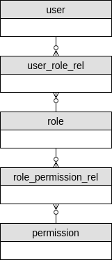
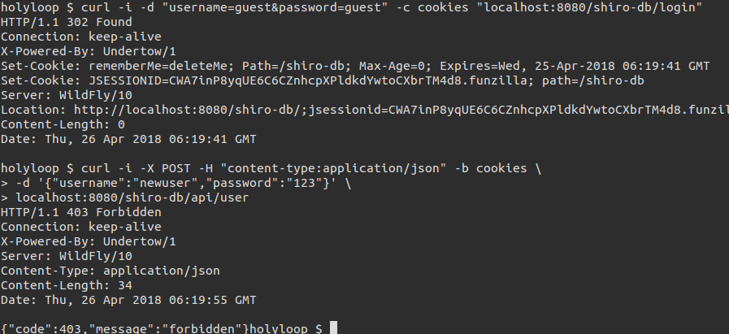
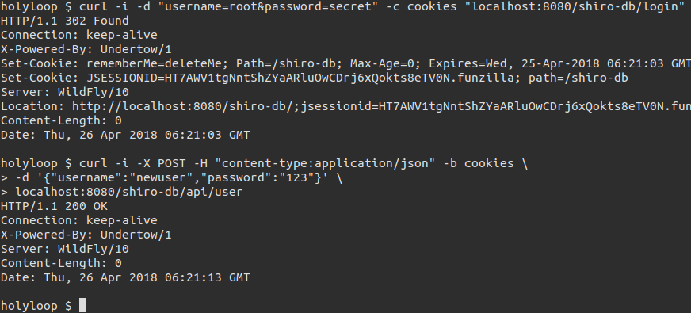
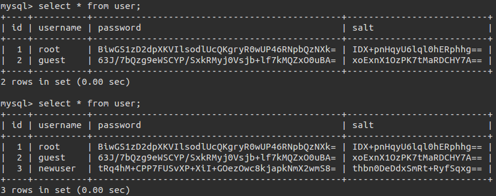
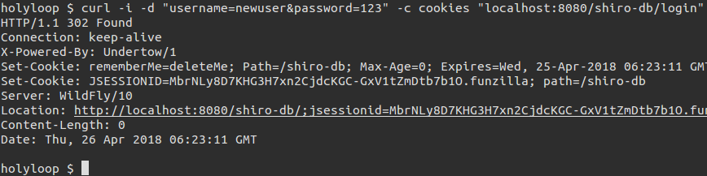
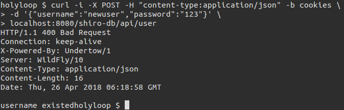

# Java EE 7基于数据库的Apache Shiro配置

[上一篇文章](https://www.cnblogs.com/holyloop/p/8909336.html)我介绍了在Java EE环境中配置Shiro的基本方法, 但是在真正的开发过程中我们基本上不会使用基于配置文件的用户角色配置, 大多数情况下我们会将用户, 角色和权限存储在数据库中, 然后我们告诉Shiro去数据库中取数据, 这样的配置更灵活且功能更强大.

这样使Shiro能读数据库(或LDAP, 文件系统等)的组件叫做[Realm](https://shiro.apache.org/realm.html), 可以把Realm看作是一个安全专用的DAO, 下面我详细介绍一下如何配置Realm:

(所用到的技术和上一篇文章中的类似, 此外, 我们用到了JPA, 项目源码参考我的[Github](https://github.com/holyloop/javaee-example/tree/master/javaee-shiro-database))

## 添加依赖

在上一篇文章所用的依赖基础上, 我们还需要添加:

```xml
<dependency>
  <groupId>org.hibernate.javax.persistence</groupId>
  <artifactId>hibernate-jpa-2.1-api</artifactId>
  <version>1.0.0.Final</version>
</dependency>
<dependency>
  <groupId>org.jboss.spec.javax.ejb</groupId>
  <artifactId>jboss-ejb-api_3.2_spec</artifactId>
  <version>1.0.0.Final</version>
  <scope>provided</scope>
</dependency>
<dependency>
  <groupId>org.apache.commons</groupId>
  <artifactId>commons-lang3</artifactId>
  <version>3.7</version>
</dependency>
```

## 添加用户等实体

### ER图

这里我将用户(User), 角色(Role), 权限(Permission)的关系定义为:



为简单起见, ER图省略了表的字段, 这里仅说明表之间的关系: 一个用户可以有多个角色, 一个角色有多个权限.

### JPA实体

`src/main/java/com/github/holyloop/entity/User.java`:

```java
@Id
@GeneratedValue(strategy = GenerationType.IDENTITY)
@Column(unique = true, nullable = false)
private Long id;

@Column(nullable = false, unique = true)
private String username;

@Column(nullable = false)
private String password;

@Column(nullable = false)
private String salt;

@OneToMany(mappedBy = "user")
private Set<UserRoleRel> userRoleRels = new HashSet<>(0);
```

这里的 `password` 为密文密码, `salt` 为哈希加密用到的盐, 我们让每个用户都有一个随机盐.

`src/main/java/com/github/holyloop/entity/Role.java`:

```java
@Id
@GeneratedValue(strategy = GenerationType.IDENTITY)
@Column(unique = true, nullable = false)
private Long id;

@Column(name = "role_name", nullable = false, unique = true)
private String roleName;

@OneToMany(mappedBy = "role")
private Set<UserRoleRel> userRoleRels = new HashSet<>(0);

@OneToMany(mappedBy = "role")
private Set<RolePermissionRel> rolePermissionRels = new HashSet<>(0);
```

`roleName` 如名字所述, 为权限名.

`src/main/java/com/github/holyloop/entity/Permission.java`:

```java
@Id
@GeneratedValue(strategy = GenerationType.IDENTITY)
@Column(unique = true, nullable = false)
private Long id;

@Column(name = "permission_str", nullable = false)
private String permissionStr;
```

`permissionStr` 为权限字符串, 我一般偏爱将权限字符串定义为 `resource-type:operation:instance` , 意为**操作**(operation)**资源**(resource-type)**实例**(instance)的权限, 例如: `org:update:1` 即为"更新id为1的组织"权限. 这种组织权限的方式较灵活, 能精确到**资源实例**, 在对权限要求教高的系统中可以使用这种方式, 一般对于权限不要求精确到资源实例的系统用传统的[RBAC](https://en.wikipedia.org/wiki/Role-based_access_control)即可满足要求. 关于权限的详细定义可参考Shiro的[这个文档](https://shiro.apache.org/permissions.html).

剩下的两个中间关系表较简单, 这里不详细说明.

## 修改shiro.ini

`src/main/webapp/WEB-INF/shiro.ini`:

```ini
[main]
authc.loginUrl = /login

credentialsMatcher = org.apache.shiro.authc.credential.Sha256CredentialsMatcher
credentialsMatcher.storedCredentialsHexEncoded = false
credentialsMatcher.hashIterations = 1024

dbRealm = com.github.holyloop.secure.shiro.realm.DBRealm
dbRealm.credentialsMatcher = $credentialsMatcher

securityManager.realms = $dbRealm

[urls]
/index.html = anon
/login = authc
```

比较之前的配置, 我删掉了 `[users]` 和 `[roles]` 块, 因为这些数据我们将从数据库中加载. 此外, 我配置了Shiro的密码匹配器 `credentialsMatcher` , 它将用sha256来做密码匹配; 然后还有我们这篇文章的重点 `dbRealm` , 这个Realm将由我们自己来实现.

## 实现Realm

我们的 `DBRealm`  将继承[AuthorizingRealm](https://shiro.apache.org/static/1.2.2/apidocs/org/apache/shiro/realm/AuthorizingRealm.html), 然后覆盖它的 `doGetAuthorizationInfo` 和 `doGetAuthenticationInfo` 方法, 这两个方法分别用来获取权限信息和认证信息:

`src/main/java/com/github/holyloop/secure/shiro/realm/DBRealm.java`:

```java
@Override
protected AuthorizationInfo doGetAuthorizationInfo(PrincipalCollection principals) {

  String username = StringUtils.trim((String) principals.getPrimaryPrincipal());

  Set<String> roles = userService.listRolesByUsername(username);
  Set<String> permissions = userService.listPermissionsByUsername(username);

  SimpleAuthorizationInfo authorizationInfo = new SimpleAuthorizationInfo();
  authorizationInfo.setRoles(roles);
  authorizationInfo.setStringPermissions(permissions);

  return authorizationInfo;
}

@Override
protected AuthenticationInfo doGetAuthenticationInfo(AuthenticationToken token) throws AuthenticationException {

  String username = StringUtils.trim((String) token.getPrincipal());
  if (StringUtils.isEmpty(username)) {
    throw new AuthenticationException();
  }

  User user = userService.getOneByUsername(username);
  if (user == null) {
    throw new AuthenticationException();
  }
  SimpleAuthenticationInfo authenticationInfo = new SimpleAuthenticationInfo(
    username,
    user.getPassword(),
    new SimpleByteSource(Base64.decode(user.getSalt())),
    getName());

  return authenticationInfo;
}
```

`doGetAuthorizationInfo` 将加载用户的角色和权限数据, `doGetAuthenticationInfo` 根据用户输入的口令查找对应用户的认证数据(密文密码+盐).

此外, 这两个方法都用到了 `UserService` , 它的实现比较简单, 如 `getOneByUsername` :

```java
public User getOneByUsername(String username) {
  if (StringUtils.isEmpty(username)) {
    throw new IllegalArgumentException("username must not be null");
  }

  try {
    return userRepository.getOneByUsername(username);
  } catch (NoResultException e) {
    return null;
  }
}
```

`UserService` 则依赖 `UserRepository` , 它是基于JPA的数据库访问接口, 具体的实现细节可以参考我的[Github](https://github.com/holyloop/javaee-example/tree/master/javaee-shiro-database)上的源码.

## 添加用户

到上面为止, 用户认证及鉴权的部分已经基本完成了. 但只有鉴权功能对一个系统来说是不完整的, 我们还需要能添加新的用户. 我们给 `UserService`  添加一个添加新用户的接口:

```java
public void addUser(UserDTO user) throws UsernameExistedException {
  if (user == null) {
    throw new IllegalArgumentException("user must not be null");
  }

  try {
    User duplicateUser = userRepository.getOneByUsername(user.getUsername());
    if (duplicateUser != null) {
      throw new UsernameExistedException();
    }
  } catch (NoResultException e) {}

  TwoTuple<String, String> hashAndSalt = CredentialEncrypter.saltedHash(user.getPassword());

  User entity = new User();
  entity.setUsername(user.getUsername());
  entity.setPassword(hashAndSalt.t1);
  entity.setSalt(hashAndSalt.t2);

  userRepository.save(entity);
}
```

`UsernameExistedException` 如该异常名所描述, 当新用户输入的用户名与已有的用户重复时抛出该异常. `UserDTO` 结构如下:

`src/main/java/com/github/holyloop/dto/UserDTO.java` :

```java
private String username;
private String password;
```

这里我将它定义得很简单, 实际项目开发时它肯定会有更多的属性, 比如邮箱, 生日, 手机号等等.

此外很重要的一个功能是密码加密, 这里我实现了 `CredentialEncrypter` 这个加密器:

`src/main/java/com/github/holyloop/secure/shiro/util/CredentialEncrypter.java` :

```java
private static RandomNumberGenerator rng = new SecureRandomNumberGenerator();

/**
* hash + salt
* 
* @param plainTextPassword
*            明文密码
* @return
*/
public static TwoTuple<String, String> saltedHash(String plainTextPassword) {
  if (StringUtils.isEmpty(plainTextPassword)) {
    throw new IllegalArgumentException("plainTextPassword must not be null");
  }

  Object salt = rng.nextBytes();
  String hash = new Sha256Hash(plainTextPassword, salt, 1024).toBase64();
  return new TwoTuple<>(hash, salt.toString());
}
```

为了更高的安全性, 我们为每个用户都生成一个随机盐 `RandomNumberGenerator` , `saltedHash` 将明文密码和随机盐Sha256加密然后base64编码. 方法将返回密文密码和随机盐.

到这里, 整个系统的加密和解密功能就算基本完成了, 接下来我们进行一个简单的应用.

## 基本应用

### 添加REST接口

这里我们实现一个添加新用户的接口:

`src/main/java/com/github/holyloop/rest/controller/UserController.java`:

```java
@RequiresPermissions("user:insert")
@POST
@Consumes(MediaType.APPLICATION_JSON)
@Produces(MediaType.APPLICATION_JSON)
public Response addUser(UserDTO user) {
  if (user == null || StringUtils.isEmpty(user.getUsername()) || StringUtils.isEmpty(user.getPassword())) {
    return Response.status(Status.BAD_REQUEST).entity("username or password must not be null").build();
  }

  user.setUsername(StringUtils.trim(user.getUsername()));
  user.setPassword(StringUtils.trim(user.getPassword()));

  try {
    userService.addUser(user);
  } catch (UsernameExistedException e) {
    return Response.status(Status.BAD_REQUEST).entity("username existed").build();
  }

  return Response.status(Status.OK).build();
}
```

我这里以jax-rs的风格实现了这个接口, 实现逻辑很简单: 校验用户输入是否合法, 合法则调用 `UserService.addUser()` 添加该用户, 添加成功时返回200; 需要注意的是我在该接口上添加一个 `@RequiresPermissions("user:insert")` 注解, 这个注解说明接口的调用者需要有 `user-insert` 的权限.

### 部署测试

接下来我们将应用部署并用curl进行几个简单的测试.

- 测试定义的 `@RequiresPermissions("user:insert")` 权限要求:

```shell
curl -i -d "username=guest&password=guest" -c cookies "localhost:8080/shiro-db/login"
curl -i -X POST -H "content-type:application/json" -b cookies \
> -d '{"username":"newuser", "password":"123"}' \
> localhost:8080/shiro-db/api/user
```

这里我以guest用户登录, 该用户没有 "user:insert" 的权限, 可以看到请求添加用户接口响应为403, :



然后换一个拥有 "user:insert" 权限的用户登录:

```shell
curl -i -d "username=root&password=secret" -c cookies "localhost:8080/shiro-db/login"
curl -i -X POST -H "content-type:application/json" -b cookies \
> -d '{"username":"newuser", "password":"123"}' \
> localhost:8080/shiro-db/api/user
```



可以看到响应为200, 然后我们去数据库中看一下有没有新添加的 "newuser" 用户:



可以看到用户添加成功, 并且密码为密文存储

- 测试新用户登录

```shell
curl -i -d "username=newuser&password=123" -c cookies "localhost:8080/shiro-db/login"
```



登录成功.

- 重复添加该新用户

我们在添加用户的逻辑里面定义了如果用户名重复, 则新用户应添加失败:



如我们所期望的, 服务器响应为400并提示我们"username existed".

以上就是Shiro基于数据库的用户,角色,权限配置的方法, 核心的地方在于Realm的配置, Realm负责获取用户的认证和鉴权信息; 为了提高认证信息的存储安全性, 我们还进行了密码的加密处理(对于一个完备的系统来说这必不可少); 对于规模稍大的系统来说, 纯基于数据库的认证/鉴权机制是不够的, 为了提高效率还需要添加一些缓存机制, 这篇文章暂时说到这里, 关于缓存, 我们后面再聊.