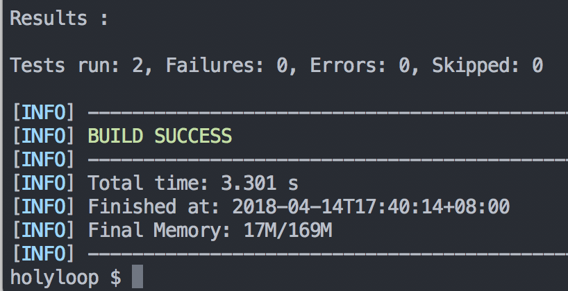

# A simple solution to test JPA entities in Java SE

For a better quality of codebase, we should test everything we wrote.

Testing in JPA is not as simple as other components, it requires a database, so actually they are integration tests. Test framework like [Arquillian](http://arquillian.org/) can do a good job in complex integration tests, but it's configuration is a little bit complex too. So, here I got a simple solution to test JPA entities in Java SE.

What we want: 1. no mysql or something else that needs our manual installation; 2. testcases can be tested in Java SE.

## Add dependencies

Add these into your project's `pom.xml`

```xml
<dependency>
  <groupId>junit</groupId>
  <artifactId>junit</artifactId>
  <version>4.12</version>
  <scope>test</scope>
</dependency>
<dependency>
  <groupId>com.h2database</groupId>
  <artifactId>h2</artifactId>
  <version>1.4.196</version>
  <scope>test</scope>
</dependency>
<dependency>
  <groupId>org.hibernate.javax.persistence</groupId>
  <artifactId>hibernate-jpa-2.1-api</artifactId>
  <version>1.0.2.Final</version>
</dependency>
<dependency>
  <groupId>org.hibernate</groupId>
  <artifactId>hibernate-core</artifactId>
  <version>5.2.10.Final</version>
</dependency>
```

Here we added h2databse, jpa2.1-api and hibernate.

## JPA Entities

Assume that we need to test a Book eitity（getters／setters are ignored）：

`src/main/java/com/github/holyloop/entity/Book.java`

```java
@Entity
@Table(name = "book")
public class Book {
    @Id
    @GeneratedValue(strategy = GenerationType.IDENTITY)
    @Column(unique = true, nullable = false)
    private Long id;

    @Column(nullable = false)
    private String title;

    @Column(nullable = false)
    private String author;
}
```

## Persistence unit

We declare a test-specified persistence unit like this:

`src/test/resources/META-INF/persistence.xml`

```xml
<?xml version="1.0" encoding="UTF-8"?>
<persistence version="2.1"
  xmlns="http://xmlns.jcp.org/xml/ns/persistence" xmlns:xsi="http://www.w3.org/2001/XMLSchema-instance"
  xsi:schemaLocation="
        http://xmlns.jcp.org/xml/ns/persistence
        http://xmlns.jcp.org/xml/ns/persistence/persistence_2_1.xsd">

  <persistence-unit name="test" transaction-type="RESOURCE_LOCAL">

    <class>com.github.holyloop.entity.Book</class>

    <properties>
      <!-- Configuring JDBC properties -->
      <property name="javax.persistence.jdbc.url"
        value="jdbc:h2:mem:test;DB_CLOSE_DELAY=-1;INIT=RUNSCRIPT FROM 'classpath:create.sql'\;
                RUNSCRIPT FROM 'classpath:data.sql'" />
      <property name="javax.persistence.jdbc.driver" value="org.h2.Driver" />

      <!-- Hibernate properties -->
      <property name="hibernate.archive.autodetection" value="class, hbm" />
      <property name="hibernate.dialect" value="org.hibernate.dialect.H2Dialect" />
      <property name="hibernate.format_sql" value="true" />
      <property name="hibernate.show_sql" value="true" />

    </properties>
  </persistence-unit>
</persistence>
```

We named the PU `test`, added a h2 database driver and some hibernate properties, these properties will produce formatted sql info.

## Testing classes

### SQL

At first, let's add some sql files:

`src/test/resources/create.sql`:

```sql
-- book
drop table if exists `book`;
create table book (
  id bigint(20) unsigned not null auto_increment,
  title varchar(50) not null,
  author varchar(20) not null,
  primary key (id)
);
```

`src/test/resources/data.sql`:

```sql
DELETE FROM book;
INSERT INTO book(id, title, author) VALUES (1, 'Spring in Action', 'Craig Walls');
```

You can also add this line of code to your testing `persistence.xml`：

```xml
<property name="hibernate.hbm2ddl.auto" value="create-drop" />
```

and without creating create.sql. This property will convert Entity to DDL automatically. I just prefer to use create.sql.

You can add any testing data to data.sql.

### Java

Let's have a look at our basic test class：

`src/test/java/com/github/holyloop/entity/BaseTest.java`:

```java
protected static EntityManagerFactory emf;
protected static EntityManager em;

@BeforeClass
public static void init() {
  emf = Persistence.createEntityManagerFactory("test");
  em = emf.createEntityManager();
}

@AfterClass
public static void tearDown() {
  em.clear();
  em.close();
  emf.close();
}
```

I declared an `EntityManagerFactory` emf and an `EntityManager` em, `init` and `tearDown` will be invoked int testing class's initiate and destroy process respectively; init will initiate the `em`, tearDown closes resources.

Keep adding methods like this:

```java
@Before
public void initDB() {
  Session session = em.unwrap(Session.class);
  session.doWork(new Work() {
    @Override
    public void execute(Connection connection) throws SQLException {
      try {
        File script = new File(getClass().getResource("/data.sql").getFile());
        RunScript.execute(connection, new FileReader(script));
      } catch (FileNotFoundException e) {
        throw new RuntimeException("could not initialize with script");
      }
    }
  });
}

@After
public void clean() {
  em.clear();
}
```

With these methods all the sub-test-methods will preload `data.sql` for us, and `em` will clear the persistence context after method's invocation.

Here comes the real test case：

`src/test/java/com/github/holyloop/entity/BookTest.java`:

```java
public class BookTest extends BaseTest {

    @Test
    public void testAddBook() {
        Book book = new Book();
        book.setTitle("new book");
        book.setAuthor("new author");

        em.getTransaction().begin();
        em.persist(book);
        em.getTransaction().commit();

        @SuppressWarnings("rawtypes")
        List books = em.createQuery("select b from Book b").getResultList();
        assertEquals(2, books.size());
    }

    @Test
    public void testQueryBook() {
        Book book = em.find(Book.class, 1L);
        assertNotNull(book);
    }

}
```

`BookTest` extends the basic test，`testAddBook` and `testQueryBook` do the job like their name says.

## Testing

So, we can now begin our tests, goto your project's root dir，`cd some-path/your-project`:

issue：

```shel
mvn clean test
```

If everything goes well, the output will be like this:


